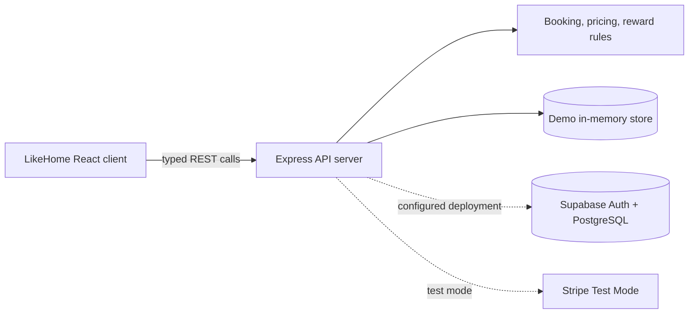
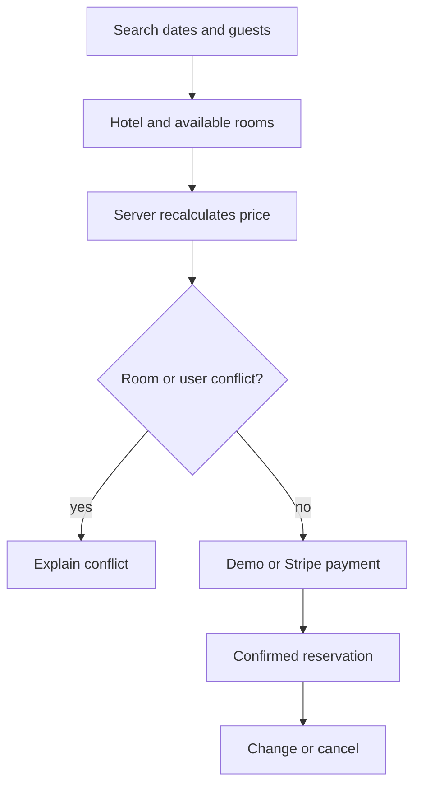

# LikeHome architecture

The workspace uses a React + Vite client and a shared Express API server routed under `/api`. The API currently includes an in-memory demonstration store so Preview is usable without external credentials; the Supabase migration and environment contract are included for the production-ready semester-project integration. Payment UI is intentionally labeled Demo Payment Mode until Stripe Test Mode credentials are configured.

