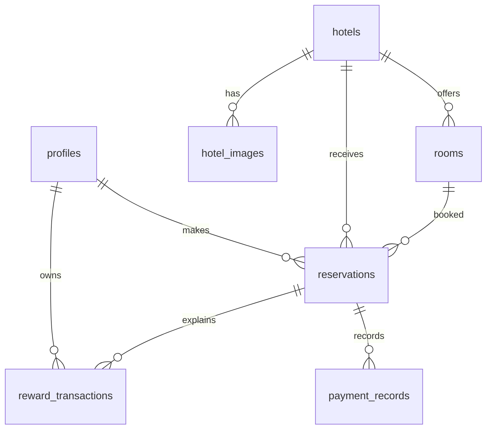

# LikeHome database design

`profiles` mirrors the Supabase Auth user and stores reward balance. `hotels` owns the searchable stay, `hotel_images` stores its gallery, and `rooms` stores capacity, pricing, and inventory. `reservations` connects a user, hotel, and room to travel dates and payment state. `reward_transactions` is an append-only points ledger. `payment_records` records charges, refunds, and cancellation charges without card data.

